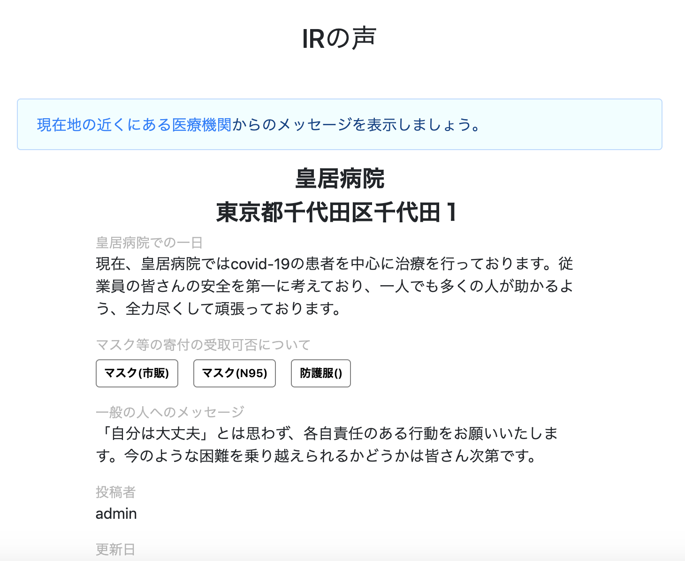
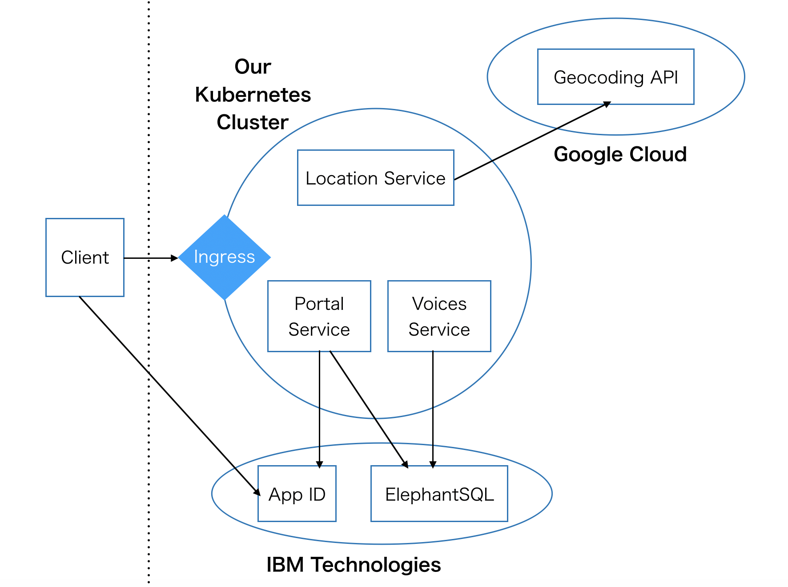

# IR支援

A platform to connect medical institutions with the community

### Contents

1. [Short description](#short-description)
1. [Component A](#component-a-voices)
1. [Component B](#component-b-collaboration)
1. [Current architecture](#current-architecture)
1. [Workflow](#workflow)
1. [Authors](#authors)
1. [License](#license)
1. [Acknowledgments](#acknowledgments)

## Short description

### What we believe

Right now, the medical system in Japan is in crisis. Hospitals and medical facilities are experiencing shortages of beds and protective equipment. But we believe that by acting as a community, we can do a lot to support medical facilities.

### Why our project

Many news outlets focus on how the government will respond to the crisis. However, in our project we focus on the voices of the medical system and the community themselves.

### The idea

There are two components to our project, explained in more detail below. 

Component A is mostly complete. Component B is a work-in-progress.

## Component A: Voices

Component A is a system that medical institutions can use to project messages directly to the community.
For example, a medical institution would post the supplies that are in need the most, and how to donate.
Facilities could also project messages or information they want the community to understand.
Example image follows.

## Component B: Collaboration

Component B is a way for the community to cooporate to stay healthy together. Users can record their vital signs, the places they visited, or any other concerns,
and share them among each other so that people who trust each other can stay safe together. We are considering adding a feature where users can also send their
data to medical facilities if willing, so that the institutions can help the patients better.
This is different from current solutions because it places the control with the user.

Component B protects the privacy of the users by asymetric encryption; each user has a public and private key.
If user A wants to share with user B and user C, user A will encrypt the data twice: once with user B's public key, and then
with user C's public key. Therefore only user B and user C will be able to read user A's data.
The server is never aware of user activity because it is all encrypted while passing the server.
We plan on using the web crypto API with IndexedDB to develop a secure solution for storing private keys within the browser.

## Current architecture

This is basically the presesnt architecture:

## Built with

 * Angular
 * Node.js
 * Kubernetes
 * [more]

## Workflow

 * [Currently] push master -> publish docker images -> kubernetes  (all with GitHub actions)
 * [Planned] Add staging, QA

## Authors

* gd, hy, and mao

## License

 * All rights reserved until further notice.

## Acknowledgments

* Based on [the Call for Code README template](https://github.com/Code-and-Response/Project-Sample).
* [Reminder to list various components used and licenses]
